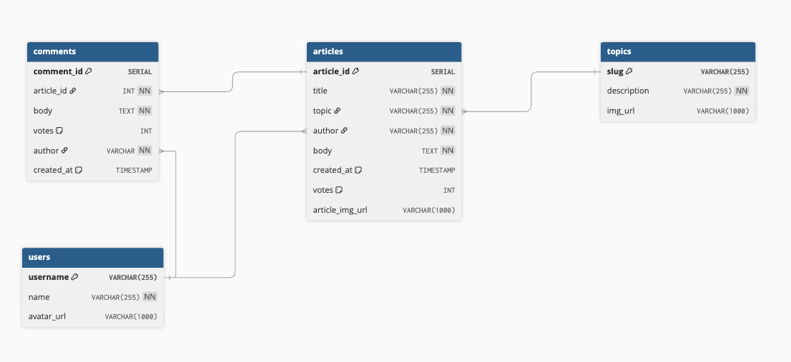

# Nabo - Reddit Style Social News Aggregator

A RESTful API for a news aggregation platform built with Node.js, Express, and PostgreSQL. This backend service provides endpoints for managing articles, topics, users, and comments, enabling a comprehensive news reading and discussion experience.

## Hosted Version

**[Live API](https://nabo.onrender.com/api)**

## Project Summary

This News Aggregator API is a backend service that allows users to:

Browse and filter news articles by topic
Read full article content
Post and manage comments on articles
Vote on articles and comments
Manage user profiles and preferences

The API follows RESTful design principles and includes comprehensive error handling, input validation, and test coverage. It's built with a focus on scalability, maintainability, and best practices.

## Tech Stack

- **Runtime:** Node.js
- **Framework:** Express.js
- **Database:** PostgreSQL
- **Cloud Database:** [Supabase](https://supabase.com/) (Production)
- **Hosting:** [Render](https://render.com/)
- **Testing:** Jest & Supertest
- **API Testing:** [Insomnia](https://insomnia.rest/)
- **Code Quality:** Husky (Git hooks)

## Prerequisites

Ensure you have the following installed on your system:

- **Node.js** - minimum version: `v21.0.0`
- **PostgreSQL** - minimum version: `16.0`

You can check your versions by running

```bash
node --versions
psql --version
```

## Project Setup

### 1. Clone the Repository and Set as Root Directory

```
git clone https://github.com/Nasif-Islam/nabo.git
cd nabo
```

### 2. Set up a .gitignore

Ensure your `.gitignore` file contains

```
node_modules
.env.\*
```

### 3. Install dependencies

```bash
npm install
```

### 4. Set Up Environment Variables

Create two .env files in the root directory for development and test databases:

\*_`.env.development_`\*

```
PGDATABASE=news_aggregator
PORT=9090    #Can be set to any port number
```

**`.env.test`**

```
PGDATABASE=news_aggregator_test
PORT=9090    #Can be set to any port number
```

> **Note:** If you're connecting to a remote database (e.g., Supabase), you'll need to add additional credentials such as the database connection string and password.

### 5. Create Development and Test Databases

```bash
npm run setup-dbs
```

This command creates the PostgresSQL databases specified in your `.env` file,s

### 6. Seed the Development Database

Populate the development database with initial data:

```bash
npm run seed-dev
```

### 7. Run the Development Server

Start the API server locally:

```bash
npm start
```

By default, the API will be running at `http://localhost:9090`, unless you have specified a different port.

## Running Tests

This project uses **Jest** and **Supertest** for testing.

### Run All Tests

```bash
npm test
```

### Run Specific Test Files

```bash
npm test
```

### Available Test Scripts

```bash
npm run test-seed    # Test database seeding
npm run test-utils   # Test utility functions
npm run test-app     # Test API endpoints
```

## Database Schema

The database consists of the following main tables:

- **users** - User accounts and profiles
- **topics** - News categories/topics
- **articles** - News articles with content
- **comments** - User comments on articles



## Available Scripts

The development server can be started by running

```bash
node listen.js
# or
npm run start
```

## Available Scripts

| Script               | Description                           |
| -------------------- | ------------------------------------- |
| `npm start`          | Start the development server          |
| `npm test`           | Run all test suites                   |
| `npm run setup-dbs`  | Create development and test databases |
| `npm run seed-dev`   | Seed the development database         |
| `npm run test-seed`  | Test database seeding                 |
| `npm run test-utils` | Test utility functions                |
| `npm run test-app`   | Test API endpoints                    |

## API Endpoints

API Endpoints

For a full list of available endpoints and their usage, refer to the API documentation or explore the `/routes` directory in the codebase.

### Example Endpoints

| Method | Endpoint                             | Description                 |
| ------ | ------------------------------------ | --------------------------- |
| GET    | `/api/articles`                      | Retrieve all articles       |
| GET    | `/api/articles/:article_id`          | Retrieve a specific article |
| POST   | `/api/articles/:article_id/comments` | Add a comment to an article |
| PATCH  | `/api/articles/:article_id`          | Update article votes        |
| GET    | `/api/topics`                        | Retrieve all topics         |
| GET    | `/api/users`                         | Retrieve all users          |

## Project Structure

```
nabo/
├── __tests__/          # Test files
├── controllers/        # Route controllers
├── db/                 # Database setup and seed data
├── models/             # Data models and database queries
├── routes/             # API route definitions
├── services/           # Business logic layer
├── utils/              # Helper functions and utilities
├── app.js              # Express application setup
├── listen.js           # Server initialization
└── package.json        # Project dependencies and scripts
```

## Development Tools

This project was developed and tested using:

- **Insomnia** - For API endpoint testing during development
- **Supabase** - PostgreSQL database hosting for production
- **Render** - Application deployment and hosting

## Contributing

This project follows best practices including:

- Git hooks via Husky for code quality checks
- Comprehensive test coverage
- Clear separation of concerns (MVC pattern)
- Error handling middleware

## Future Enhancements

Potential features for future development:

- User authentication and authorization
- Article bookmarking
- Search functionality
- Pagination for large datasets
- Rate limiting
- API documentation with Swagger/OpenAPI

## Author

**Nasif Islam**

- **GitHub:** [@Nasif-Islam](https://github.com/Nasif-Islam)
- **LinkedIn:** [nasiful-islam](https://www.linkedin.com/in/nasiful-islam)
